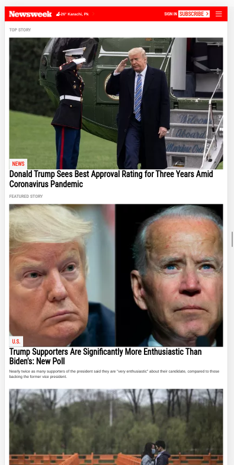
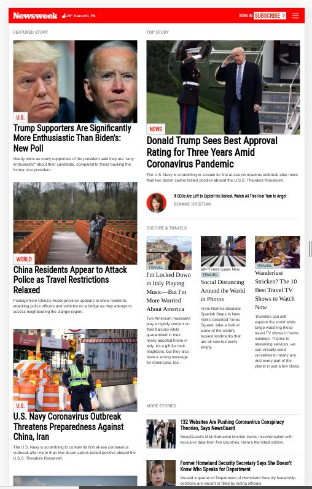
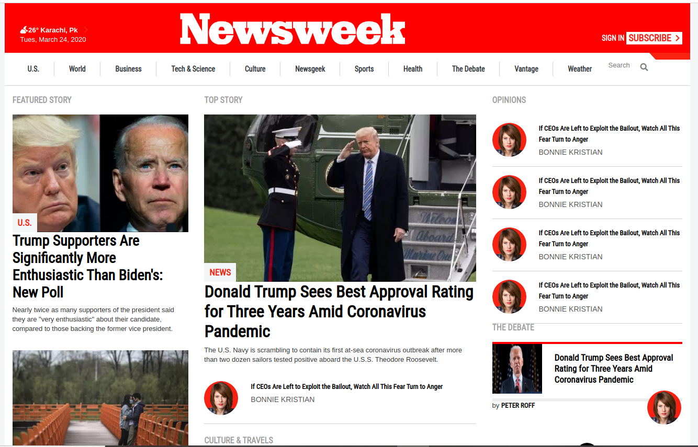

# Newsweek Clone built using Bootstrap

> This project requests students to build a replica of the news site Newsweek.com using the Bootstrap framework.

## Built With

- HTML CSS,
- Bootstrap,

## Live Demo

[Live Demo Link](https://livedemo.com)

## Getting Started

**Get a local copy of this project.**

To get a local copy up and running follow these simple example steps.

### run the following command 

git clone git@github.com:AdedayoOpeyemi/Newsweek-clone.git

## Authors

👤 **Author1**

- Github: [@Adedayoopeyemi](https://github.com/Adedayoopeyemi)
- Twitter: [@Oyelesiopy](https://twitter.com/oyelesiopy)
- Linkedin: [linkedin](https://linkedin.com/opeyemioyelesi)

## 🤝 Contributing

Contributions, issues and feature requests are welcome!

Feel free to check the [issues page](issues/).

## Show your support

Give a ⭐️ if you like this project!

## Acknowledgments

- Hat tip to anyone whose code was used
- Inspiration
- etc

## 📝 License

This project is [MIT](lic.url) licensed.
